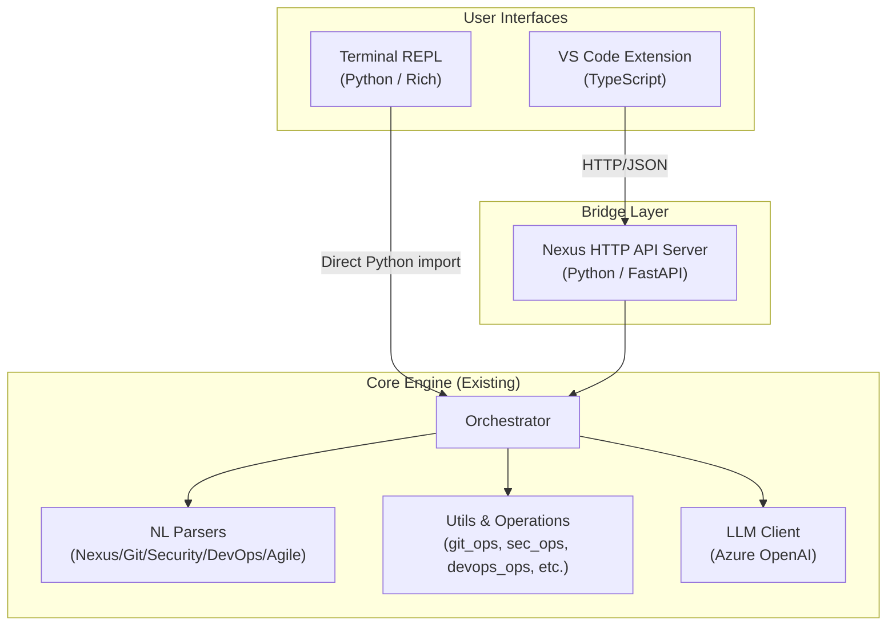

# Nexus VS Code Extension + Terminal Agent — Dual Interface Architecture

Build a VS Code extension that provides the same Nexus AI SDLC capabilities currently available in the terminal REPL, while keeping the terminal agent fully operational. Both interfaces will communicate with the same Python backend via a JSON-RPC/HTTP bridge server.

---

## High-Level Architecture



## User Review Required

> [!IMPORTANT]
> **Dual-interface strategy**: The plan keeps the terminal (`nexus terminal`) fully untouched. The VS Code extension connects to a lightweight FastAPI server that wraps the same `Orchestrator` + NL parsers. This means zero changes to the existing terminal code.

> [!IMPORTANT]
> **Extension packaging**: The Python backend will need to be running (`nexus serve`) for the extension to work. The extension will auto-detect and offer to start the server when it can't connect.

> [!WARNING]
> **Azure OpenAI keys**: The extension will rely on the same `.env` file in the workspace root. Users must have this configured already (same as terminal usage).

## Open Questions

1. **Extension marketplace name**: Should it be `nexus-sdlc` or do you prefer a different name?
2. **Port**: The bridge server will default to `http://localhost:9500`. Is that acceptable or do you prefer a different port?
3. **Extension features priority**: Which modes do you want in the VS Code extension first? All 5 modes at once, or start with Command + NLP chat and add others incrementally?
4. **Sidebar design**: Do you want a full sidebar panel (like GitHub Copilot Chat), or a bottom panel, or both?

---

## Proposed Changes

### Component 1: Python API Bridge Server (New)

Adds a lightweight FastAPI server that wraps the existing `Orchestrator` and NL parsers, exposing them as JSON API endpoints. This is the bridge between VS Code and the Python core.

#### [NEW] [server.py](file:///c:/Users/SheteChinmay/OneDrive%20-%20Stratacent%20Inc/Desktop/Chinmay_Personal/GenAi%20POC's/SDLC/src/server/server.py)

FastAPI application with these endpoints:
- `POST /api/chat` — Free NLP chat (same as typing at the `nexus >` prompt)
- `POST /api/command` — Execute a parsed command in any mode
- `POST /api/intent` — Parse natural language to intent (returns `{command, args}`)
- `GET  /api/status` — Workspace status
- `GET  /api/health` — AI health check
- `GET  /api/modes` — List available modes
- `POST /api/security/scan` — Run security scan
- `POST /api/git/{command}` — Git operations
- `POST /api/devops/{command}` — DevOps operations
- `POST /api/agile/{command}` — Agile/PM operations
- `GET  /api/tickets` — List tickets
- `POST /api/tickets/{id}/plan` — Generate plan
- `POST /api/tickets/{id}/execute` — Execute ticket
- WebSocket `/ws/chat` — Streaming chat for real-time output

#### [NEW] [__init__.py](file:///c:/Users/SheteChinmay/OneDrive%20-%20Stratacent%20Inc/Desktop/Chinmay_Personal/GenAi%20POC's/SDLC/src/server/__init__.py)

Empty init file for the server package.

#### [NEW] [models.py](file:///c:/Users/SheteChinmay/OneDrive%20-%20Stratacent%20Inc/Desktop/Chinmay_Personal/GenAi%20POC's/SDLC/src/server/models.py)

Pydantic request/response models for the API endpoints.

---

### Component 2: CLI Entry Point Update

#### [MODIFY] [program.py](file:///c:/Users/SheteChinmay/OneDrive%20-%20Stratacent%20Inc/Desktop/Chinmay_Personal/GenAi%20POC's/SDLC/src/cli/program.py)

Add a `nexus serve` Click command that starts the FastAPI server:
```python
@cli.command()
@click.option("--port", default=9500, help="API server port")
@click.option("--host", default="127.0.0.1", help="Bind address")
def serve(port, host):
    """Start the Nexus API server for VS Code extension."""
    import uvicorn
    from ..server.server import app
    uvicorn.run(app, host=host, port=port)
```

#### [MODIFY] [pyproject.toml](file:///c:/Users/SheteChinmay/OneDrive%20-%20Stratacent%20Inc/Desktop/Chinmay_Personal/GenAi%20POC's/SDLC/pyproject.toml)

Add `fastapi`, `uvicorn[standard]` to dependencies.

---

### Component 3: VS Code Extension (New — TypeScript)

A new `vscode-extension/` directory at the project root containing the full VS Code extension.

#### [NEW] vscode-extension/package.json

Extension manifest with:
- Name: `nexus-sdlc`
- Activation events: `onStartupFinished`
- Commands: `nexus.openChat`, `nexus.switchMode`, `nexus.runScan`, `nexus.showTickets`, etc.
- Sidebar view container with Nexus icon
- Configuration: `nexus.serverUrl`, `nexus.autoStartServer`
- Keybindings: `Ctrl+Shift+N` to open Nexus chat

#### [NEW] vscode-extension/src/extension.ts

Main extension entry point:
- Registers the Nexus sidebar webview provider
- Registers all commands
- Auto-detects/starts the Python API server
- Manages server lifecycle (start/stop/restart)

#### [NEW] vscode-extension/src/nexusClient.ts

HTTP client that communicates with the Python bridge server:
- `chat(message)` → `POST /api/chat`
- `parseIntent(input, mode)` → `POST /api/intent`
- `getStatus()` → `GET /api/status`
- `healthCheck()` → `GET /api/health`
- `runSecurityScan()` → `POST /api/security/scan`
- `gitCommand(cmd)` → `POST /api/git/{cmd}`
- WebSocket connection for streaming responses

#### [NEW] vscode-extension/src/sidebarProvider.ts

Webview provider for the Nexus sidebar panel:
- Chat-style interface with message history
- Mode switcher (Command / Git / Security / DevOps / Agile)
- Rich output rendering (panels, tables, colored output)
- Command quick-access buttons
- Ticket list view

#### [NEW] vscode-extension/src/webview/index.html

The sidebar webview UI:
- Dark-themed chat interface matching Nexus terminal aesthetics
- Mode indicator bar with color coding (green=Nexus, yellow=DevOps, magenta=Git, red=Security, blue=Agile)
- Input box with auto-complete suggestions
- Collapsible panel rendering for scan results, plans, etc.
- Animated spinners for async operations

#### [NEW] vscode-extension/src/webview/styles.css

Premium dark-mode styling:
- Glassmorphic panels for output display
- Mode-specific accent colors matching terminal theme
- Smooth transitions between modes
- Rich typography with JetBrains Mono / Inter fonts
- Micro-animations for message appearance

#### [NEW] vscode-extension/src/webview/main.js

Webview client-side JavaScript:
- VS Code API communication (`acquireVsCodeApi()`)
- Message rendering with Rich markup → HTML conversion
- Chat history management
- Mode switching logic
- Keyboard shortcuts

#### [NEW] vscode-extension/src/serverManager.ts

Manages the Python server lifecycle:
- Detects if server is already running
- Starts `nexus serve` as a child process
- Health check polling
- Auto-restart on crash
- Graceful shutdown on extension deactivation

#### [NEW] vscode-extension/src/statusBar.ts

VS Code status bar integration:
- Shows current Nexus mode (with color)
- Server connection status indicator
- Click to switch modes or open chat

#### [NEW] vscode-extension/src/commands.ts

Registers all VS Code commands:
- `nexus.openChat` — Open/focus the sidebar
- `nexus.switchMode` — Quick-pick mode selector
- `nexus.runScan` — Run security scan on current file/workspace
- `nexus.showTickets` — Show Jira tickets
- `nexus.planTicket` — Plan a specific ticket
- `nexus.executeTicket` — Execute a ticket
- `nexus.gitStatus` — Quick git status
- `nexus.healthCheck` — Check AI + system health

#### [NEW] vscode-extension/tsconfig.json
#### [NEW] vscode-extension/.vscodeignore
#### [NEW] vscode-extension/webpack.config.js

Build configuration files for the extension.

---

### Component 4: Extension Assets

#### [NEW] vscode-extension/media/nexus-icon.svg

Sidebar icon for the Nexus activity bar entry.

#### [NEW] vscode-extension/media/nexus-logo.svg

Logo displayed in the sidebar header.

---

## Project Structure After Changes

```
SDLC/
├── src/                          # Python core (UNCHANGED)
│   ├── cli/
│   │   ├── terminal.py           # Terminal REPL (UNCHANGED)
│   │   └── program.py            # + `nexus serve` command
│   ├── core/                     # Orchestrator, types, etc. (UNCHANGED)
│   ├── utils/                    # All operations (UNCHANGED)
│   ├── agents/                   # AI agents (UNCHANGED)
│   ├── config/                   # Config (UNCHANGED)
│   └── server/                   # NEW — API bridge
│       ├── __init__.py
│       ├── server.py             # FastAPI app
│       └── models.py             # Request/response models
├── vscode-extension/             # NEW — VS Code extension
│   ├── package.json
│   ├── tsconfig.json
│   ├── webpack.config.js
│   ├── .vscodeignore
│   ├── src/
│   │   ├── extension.ts
│   │   ├── nexusClient.ts
│   │   ├── sidebarProvider.ts
│   │   ├── serverManager.ts
│   │   ├── statusBar.ts
│   │   ├── commands.ts
│   │   └── webview/
│   │       ├── index.html
│   │       ├── styles.css
│   │       └── main.js
│   └── media/
│       ├── nexus-icon.svg
│       └── nexus-logo.svg
├── pyproject.toml                # + fastapi, uvicorn deps
├── requirements.txt              # + fastapi, uvicorn deps
└── README.md                     # Updated with extension docs
```

## Verification Plan

### Automated Tests

1. **Python server tests**: Start the FastAPI server and test each endpoint with `httpx` test client
   ```bash
   python -m pytest tests/test_server.py -v
   ```

2. **Extension compilation**: Verify TypeScript compiles cleanly
   ```bash
   cd vscode-extension && npm run compile
   ```

3. **Extension packaging**: Package the VSIX and verify it installs
   ```bash
   cd vscode-extension && npx vsce package
   ```

4. **Integration test**: Start the server, launch the extension in Extension Development Host, send a chat message, verify response

### Manual Verification

1. Run `nexus terminal` — verify terminal REPL works exactly as before (no regressions)
2. Run `nexus serve` — verify server starts on port 9500
3. Open VS Code with the extension — verify sidebar appears
4. Send a chat message via VS Code — verify response from backend
5. Switch modes in VS Code — verify mode-specific commands work
6. Run a security scan from VS Code — verify scan results display
7. Check that the status bar shows correct mode and connection status
