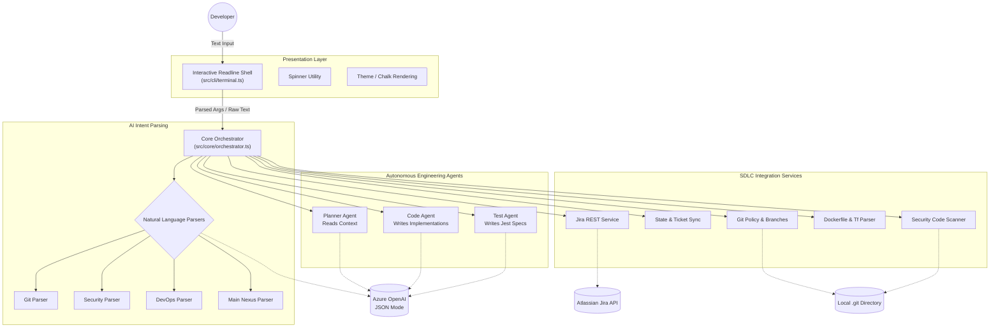

# Nexus SDLC CLI: Comprehensive Technical & Architectural Report

---

## 1. Executive Summary & Vision

The **Nexus CLI** is a next-generation Software Development Lifecycle (SDLC) orchestrator designed to unify the fragmented landscape of modern software engineering. Traditionally, developers switch between terminals for Git, browsers for Jira, IDEs for coding, and third-party tools for static analysis (SAST) and CI/CD validation. 

Nexus integrates all these facets into a single, cohesive, AI-powered terminal interface. It operates natively within the developer's workspace, acting not just as a chatbot, but as an **Autonomous Agent** capable of understanding the codebase, generating unit tests, enforcing GitFlow compliance, and auditing Docker configurations in real-time.

By leveraging a hybrid architecture—combining deterministic rule-based parsing with advanced LLM intent resolution (Azure OpenAI)—Nexus guarantees reliability while offering the flexibility of natural language interaction.

---

## 2. Core Architectural Philosophy

### 2.1 The Hub-and-Spoke Orchestrator Model
At the heart of Nexus is the `Orchestrator` (`src/core/orchestrator.ts`). The CLI layer (`terminal.ts`) is completely "dumb"; it only knows how to capture keystrokes, render colors (using `chalk`), and display loading spinners. It delegates all business logic to the Orchestrator. 

This separation of concerns ensures that the core Nexus engine could theoretically be detached from the terminal and run as a REST API, a GitHub App, or a VS Code extension with zero changes to the underlying logic.

### 2.2 Strict Intent Parsing
Nexus avoids the "prompt injection" or "hallucination" problems common in standard AI chatbots by using a dual-layer parser:
1. **Regex/Keyword Layer**: If a user types exactly `tickets` or `plan AUTH-101`, the system routes it instantly with zero latency and zero LLM cost.
2. **LLM Fallback Layer**: If a user types *"can you merge this branch and push it?"*, the Intent Parsers use few-shot prompting to force the LLM to return a strict, typed JSON intent: `{ "command": "push", "args": [] }`.

### 2.3 Agentic Separation of Concerns
When Nexus is tasked with writing code, it does not use a single monolithic prompt. It utilizes an **Agentic Workflow**:
*   **Planner Agent**: Thinks about the architecture.
*   **Code Agent**: Implements the architecture.
*   **Test Agent**: Verifies the implementation.
This multi-step verification drastically reduces AI hallucinations.

---

## 3. Technology Stack Breakdown

*   **Runtime**: Node.js (v18+). Chosen for its asynchronous event-driven architecture, making it ideal for concurrently reading hundreds of files and making network requests.
*   **Language**: TypeScript (v5.8.3). Provides compile-time safety and self-documenting code.
*   **Execution**: `tsx`. Allows running raw TypeScript files in development without a build step.
*   **CLI Framework**: `Commander.js`. Handles binary registration (`npm install -g .`), argument parsing, and `--help` flags.
*   **Version Control Wrapper**: `simple-git`. A promise-based interface to the native `git` binary, ensuring Git commands are executed safely within the Node context.
*   **AI Engine**: Azure OpenAI (Model: GPT-4.1-preview). Configured with `response_format: { type: "json_object" }` to guarantee machine-readable outputs.

---

## 4. Comprehensive System Architecture Diagram

---

## 5. Module Deep-Dive: Core Services

### 5.1 The Terminal Interface (`src/cli/terminal.ts`)
The terminal uses Node's native `readline` module to create a persistent shell. It maintains an internal `mode` state (`command`, `git`, `devops`, `security`, `nlp`). 
Depending on the mode, the `readline.on("line")` listener routes the input to a different handler (e.g., `handleSecurityInput` vs `handleGitInput`). It wraps all operations in a custom `withSpinner` utility so the UI never freezes during HTTP requests.

### 5.2 Context Builder (`src/core/context-builder.ts`)
Before the LLM can generate code, it must understand the repository. The Context Builder recursively scans the workspace (respecting `.gitignore` and skipping `node_modules`). It concatenates file contents into an optimized text blob. To preserve LLM token limits, it intelligently truncates massive files and prioritizes files ending in `.ts`, `.tsx`, `.json`, and `.yml`.

### 5.3 Jira Service (`src/core/jira-service.ts`)
Nexus syncs with Atlassian Jira using basic auth (Email + API Token encoded in Base64). 
It fetches tickets via Jira Query Language (JQL): 
`project = "SDLC" AND statusCategory != Done ORDER BY created DESC`.
Because Jira uses Atlassian Document Format (ADF) for rich text, the service contains a recursive `parseAdf()` function to strip out formatting and convert Jira tickets into plain markdown that the LLM can easily read.

---

## 6. Module Deep-Dive: Autonomous Agents

The true power of Nexus lies in its generative capabilities located in `src/agents/`.

### 6.1 Planner Agent (`planner-agent.ts`)
*   **Input**: The Jira ticket description and the Codebase Context string.
*   **System Prompt Constraint**: "Return a strictly typed JSON object: `{\"steps\": string[]}`."
*   **Behavior**: It does not emit code. It emits high-level architectural steps. E.g., `["Create a User interface in types.ts", "Update auth.ts to hash passwords using bcrypt", "Add a login route to server.ts"]`.

### 6.2 Code Agent (`code-agent.ts`)
*   **Input**: The steps generated by the Planner Agent.
*   **System Prompt Constraint**: `{"files": [{"path": string, "content": string}]}`.
*   **Behavior**: The LLM writes the actual code. The Orchestrator receives this JSON array and uses the native `fs` module to physically create or overwrite the files in the developer's local workspace.

### 6.3 Test Agent (`test-agent.ts`)
*   **Input**: Only the specific `CodeChange` array generated by the Code Agent.
*   **Behavior**: It generates Jest or Mocha test files specifically targeting the newly generated logic. This isolation ensures the Test Agent focuses entirely on code coverage for the immediate diff.

---

## 7. Security Mode: AI-Driven SAST Engine

Located in `src/utils/security-operations.ts` and `src/utils/code-scanner.ts`.

### 7.1 Hybrid Scanning Approach
Nexus replaces traditional regex-based scanners (which suffer from massive false-positive rates) with an AI-driven Static Application Security Testing (SAST) approach.
1.  Nexus reads a source file (`auth.ts`).
2.  It appends line numbers to every line of code (e.g., `14: const pwd = "123";`).
3.  It sends the file to the LLM with instructions to identify OWASP top 10 vulnerabilities (Injection, Broken Access Control, Hardcoded Secrets).
4.  The LLM returns an array of findings, pointing to the exact line number.

### 7.2 The Auto-Correction Layer
LLMs frequently hallucinate line numbers. If the LLM says a secret is on line `45`, Nexus will physically verify that line `45` contains the reported `matchedContent`. If it does not, Nexus searches the physical file for the `matchedContent` and auto-corrects the line number in the final report, guaranteeing 100% accurate terminal outputs.

### 7.3 Infrastructure & Dependency Auditing
*   **Dockerfile Security**: Nexus parses Dockerfiles to ensure the `USER` is non-root, `HEALTHCHECK` is defined, and `COPY` is used instead of `ADD`.
*   **Terraform Validation**: It parses `main.tf` to check for state encryption, KMS usage, and DynamoDB state locking.
*   **License Compliance**: It reads `package.json` and recursively checks the licenses of all `node_modules` against a list of restrictive copyleft licenses (e.g., `GPL-3.0`, `AGPL-3.0`).

---

## 8. DevOps Mode & CI/CD Validation

Located in `src/utils/devops-operations.ts` and `src/utils/cicd.ts`.

### 8.1 Pipeline Parsing
Nexus can natively read `Jenkinsfile` (Declarative Pipeline) and GitHub Actions (`.github/workflows/*.yml`) files. 
It uses regex and the `yaml` parser to extract pipeline stages (e.g., `Build`, `Test`, `Deploy`). It alerts the developer if the pipeline is missing critical stages like "Security Scan" or "Linting".

### 8.2 Environment Auditing
Nexus provides a command to compare environment variables across multiple files (e.g., `dev.json` vs `prod.json`). It highlights missing keys, ensuring that a secret required in staging isn't accidentally omitted in production prior to a deployment.

---

## 9. Git Mode & Enterprise Policy Enforcement

Located in `src/utils/git-operations.ts` and `src/utils/git-policy.ts`.

### 9.1 Conversational Git
Developers can type: *"create a new branch for ticket AUTH-101 and push it"*. The Intent Parser converts this to standard `simple-git` commands (`git.checkoutLocalBranch`, `git.push`).

### 9.2 Compliance Engine
Before any commit or branch is created, Nexus enforces Enterprise policies:
*   **Branch Naming**: Enforces GitFlow (`feature/`, `bugfix/`, `hotfix/`, `release/`).
*   **Commit Messages**: Enforces Conventional Commits (`feat:`, `fix:`, `chore:`).
*   **Direct Push Protection**: Actively blocks developers from pushing directly to `main`, `master`, or `develop` branches without going through a Pull Request.

---

## 10. AI Implementation Details (Azure OpenAI)

Located in `src/utils/llm.ts`.

Nexus relies entirely on Azure OpenAI. The wrapper uses native Node `fetch` to communicate with the Azure REST API endpoint:
`POST {AZURE_ENDPOINT}/openai/deployments/{DEPLOYMENT}/chat/completions`

**Critical Configurations:**
*   **Temperature**: Hardcoded to `0.0` or `0.2`. Because Nexus expects structured JSON routing instructions or exact code, creativity is discouraged in favor of absolute determinism.
*   **Error Handling**: The `formatAiError` function catches HTTP 401s, 404s, and `ENOTFOUND` DNS errors, translating generic Node fetch errors into actionable CLI guidance (e.g., "Azure rejected the API key. Verify AZURE_OPENAI_API_KEY").

---

## 11. Configuration and Extensibility

### 11.1 The Environment Schema
Nexus relies on `.env` files parsed by `dotenv`. Key parameters include:
*   `AZURE_OPENAI_ENDPOINT` & `AZURE_OPENAI_API_KEY`
*   `JIRA_HOST`, `JIRA_EMAIL`, `JIRA_API_TOKEN`
*   `VAULT_ENABLED` (Flags whether secrets should be read from local env or HashiCorp Vault).

### 11.2 Extensibility
Because of the Hub-and-Spoke design, extending Nexus is trivial:
1.  **To add a new Mode (e.g., "Cloud Mode")**:
    *   Create `src/utils/cloud-nl-parser.ts` to map user text to Cloud Intents.
    *   Create `src/utils/cloud-operations.ts` to execute AWS/GCP logic.
    *   Add an `else if (mode === "cloud")` block in `terminal.ts`.
2.  **To swap LLMs (e.g., to Anthropic Claude)**:
    *   Only `src/utils/llm.ts` needs to be modified. The rest of the system is entirely agnostic to the AI provider.

---

## Conclusion

The Nexus CLI represents a paradigm shift in how engineers interact with their repositories. By delegating cognitive load to specialized AI agents and combining disjointed CI/CD, Git, and Security toolchains into a singular conversational interface, Nexus dramatically accelerates development velocity while simultaneously improving enterprise security and compliance postures.

*Generated by Advanced Agentic Coding Engine.*

<!-- 

In the Nexus CLI architecture, the roles are strictly separated into an orchestrator and specialized sub-agents.

The Main Agent
The "Main Agent" is actually the Orchestrator (src/core/orchestrator.ts). It acts as the brain or the "manager". It doesn't write any code itself; instead, its job is to listen to the terminal, manage the state of your workspace, read the Jira tickets, build the codebase context, and delegate the actual software engineering work to the sub-agents.

The 3 Sub-Agents
When the Orchestrator executes a ticket (e.g., you type execute AUTH-101), it coordinates exactly 3 distinct sub-agents, which are located in the src/agents/ directory:

Planner Agent (planner-agent.ts): The architect. It takes the ticket description and the codebase context and returns a strict list of architectural steps. It decides how to build the feature but writes zero code.
Code Agent (code-agent.ts): The developer. It takes the steps generated by the Planner Agent and actually implements them, returning the raw TypeScript file contents which the Orchestrator then writes to your physical hard drive.
Test Agent (test-agent.ts): The QA engineer. Once the Code Agent finishes, the Test Agent looks only at the newly generated code and writes the Jest unit tests to verify that the new logic works correctly.
This multi-agent separation ensures that the AI doesn't get confused by trying to plan, write, and test a feature all in a single monolithic prompt! -->
