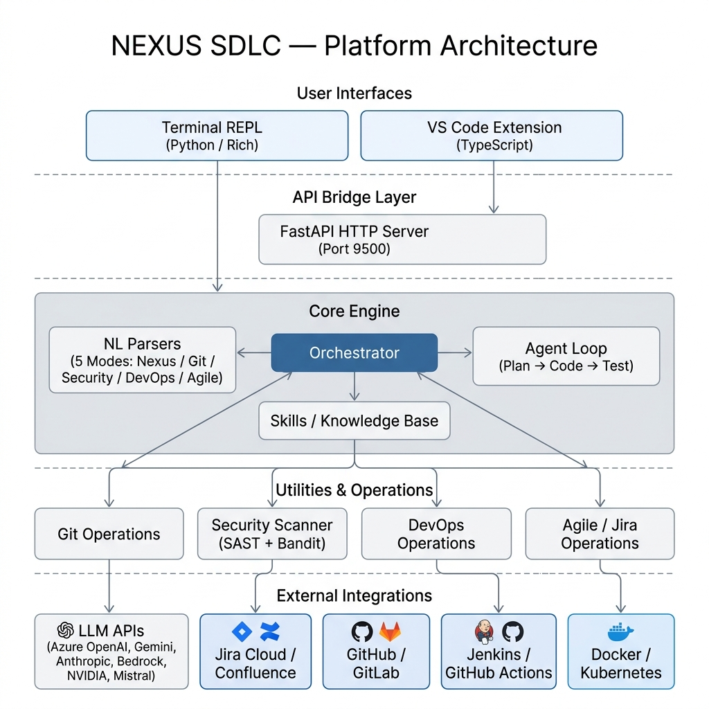

# Nexus SDLC — High-Level Platform Architecture

---

## Layer 1 — User Interfaces

| Interface | Technology | Description |
|-----------|-----------|-------------|
| **Terminal REPL** | Python / Rich / prompt_toolkit | Interactive command-line with 5 specialized modes (Nexus, Git, Security, DevOps, Agile) and freeform AI chat |
| **VS Code Extension** | TypeScript | Sidebar UI with chat panel, ticket browser, security scanner, and inline AI assistance |

## Layer 2 — API Bridge

| Component | Technology | Description |
|-----------|-----------|-------------|
| **FastAPI HTTP Server** | FastAPI + Uvicorn (Port 9500) | REST + WebSocket bridge connecting the VS Code extension to the Python core engine. The Terminal REPL imports the core engine directly. |

## Layer 3 — Core Engine

| Component | Description |
|-----------|-------------|
| **Orchestrator** | Central coordinator — routes requests to agents, services, and operations modules |
| **NL Parsers** | 5 mode-specific natural language parsers (Nexus, Git, Security, DevOps, Agile) with regex rules + LLM intent classification fallback |
| **Agent Loop** | Autonomous agent that chains tools (read_file → edit_file → run_command) with user permission gating |
| **Planner / Coder / Tester Agents** | Specialized agents for ticket planning, code generation, and test generation |
| **Skills / Knowledge Base** | Loads `.md`, `.yaml`, `.json` files from the `Skills/` folder to inject team standards into all AI prompts |

## Layer 4 — Utilities & Operations

| Module | Capabilities |
|--------|-------------|
| **Git Operations** | status, log, diff, branch, commit, push, pull, stash, cherry-pick, blame, merge, GitHub API |
| **Security Scanner** | 15 SAST rules + Bandit/PySA + AI deep scan + SHA-256 incremental scanning + secrets detection |
| **DevOps Operations** | Jenkins, GitHub Actions, Docker, Kubernetes, Terraform, deployments, releases, monitoring |
| **Agile / Jira Operations** | Tickets, epics, stories, sprints, board view, transitions, comments, bulk operations via Jira REST API |

## Layer 5 — External Integrations

| Integration | Purpose |
|-------------|---------|
| **LLM APIs** | Azure OpenAI, Google Gemini, Anthropic Claude, AWS Bedrock, NVIDIA NIM, Mistral AI, Ollama/vLLM |
| **Jira Cloud / Confluence** | Ticket management, sprint tracking, requirements extraction |
| **GitHub / GitLab** | Repository operations, pull requests, issues, releases |
| **Jenkins / GitHub Actions** | CI/CD pipeline validation, triggering, and monitoring |
| **Docker / Kubernetes** | Container builds, image management, pod orchestration, scaling |
