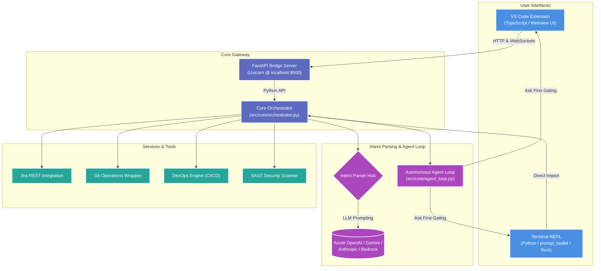

# Nexus — Enterprise AI SDLC Terminal Assistant
## Executive & Technical Architecture Presentation Guide

---

> [!NOTE]
> **Demo Readiness Check**
> This document has been prepared specifically for your client presentation today. It contains high-level business values, technical architecture blueprints, and a structured script for a live software demonstration.

---

## 1. Executive Summary & Value Proposition

**Nexus** is an intelligent, workspace-agnostic orchestration engine that unifies the fragmented Software Development Lifecycle (SDLC) into a single, conversational interface. It bridges the gap between development workflows, security policies, DevOps pipelines, and project management.

### Key Business Benefits
*   **Zero Context-Switching**: Developers no longer switch between the CLI (for Git), web browsers (for Jira/Confluence), and third-party security scanners. Everything is accessible in a single terminal or VS Code interface.
*   **Shift-Left Security & Compliance**: Automated security checks and git branching policies are enforced locally *before* code is committed, dramatically reducing pipeline failures and security remediation costs.
*   **Proactive Guardrails ("Ask First" Policy)**: Nexus operates as a gated autonomous agent. It can suggest plans and draft code changes, but enforces strict user confirmation prompts before performing any write operations.
*   **Instant Verification (Incremental Scans)**: Employs an intelligent cryptographic SHA-256 fingerprint cache. Heavy processes like SAST scans execute in milliseconds by only analyzing files changed since the last snapshot.

---

## 2. System Architecture

Nexus uses a decoupled **Dual-Interface Hub-and-Spoke** architecture. The core reasoning and service integrations are implemented in **Python 3.10+**, while the user interfaces interact with this core either directly or through a lightweight FastAPI bridge.

### 2.1 Complete Architectural Workflow Diagram



### 2.2 Text-Based Architecture Layout
*(Use this as a quick reference during the presentation or if showing plain text)*

```
+----------------------------------------------------------------------------+
|                             USER INTERFACES                                |
|  [VS Code Extension (TS/Webview)]  <-->  [Terminal REPL (prompt_toolkit)]  |
+----------------------------------------------------------------------------+
                                     ||
                 Communicates via WebSockets & FastAPI REST
                                     ||
                                     \/
+----------------------------------------------------------------------------+
|                          NEXUS CORE ORCHESTRATOR                           |
|       - Manages execution state and session configuration (.sdlc/)         |
|       - Decouples client presentation from core business logic             |
+----------------------------------------------------------------------------+
       ||                            ||                          ||
       \/                            \/                          \/
+------------------+         +------------------+         +------------------+
|  INTENT PARSERS  |         |   AGENT LOOP     |         |   INTEGRATIONS   |
|  - Dual-layer:   |         |  - Planner Agent |         |  - Atlassian Jira|
|    Regex + LLM   |         |  - Code Agent    |         |  - Git Versioning|
|  - Maps text to  |         |  - Test Agent    |         |  - SAST Scanner  |
|    JSON commands |         |  - "Ask First"   |         |  - DevOps Config |
+------------------+         +------------------+         +------------------+
```

---

## 3. The 5 Specialized Operational Modes

Nexus categorizes commands and assistance into five specialized execution environments. Developers switch modes by simply typing the mode name (e.g. `devops`, `git`, `security`, `agile`) or exit back to the main prompt by typing `exit`.

### 🚀 1. Main (Nexus) Mode: Conversational Hub
*   **Purpose**: General repository chat, workspace coordination, implementation planning, and mode switching.
*   **Core Capabilities**:
    *   Full repository knowledge base chat (context-aware).
    *   `nexus tickets`: List current work items.
    *   `nexus plan <id>`: Query Jira/Confluence context to build step-by-step implementation plans.
    *   `nexus execute <id>`: Run the autonomous agent loop to generate code and Jest/PyTest unit tests.
    *   `nexus status`: Show ticket development progress.
*   **Tech Stack**: Click CLI wrapper, prompt_toolkit shell sessions, and Azure OpenAI LLM orchestration.

### 🛡️ 2. Security Mode: AI-Driven SAST & Compliance Gate
*   **Purpose**: Spotting security risks, secrets, and infrastructure misconfigurations locally.
*   **Core Capabilities**:
    *   `scan`: Run an incremental SAST code audit targeting injection flaws, XSS, and broken access control.
    *   `scan file <path>`: Targeted AI analysis of a specific file.
    *   `secrets`: Check the codebase for hardcoded API keys, passwords, and private tokens.
    *   `compliance`: Evaluate repository files against organization compliance rules.
    *   `docker security` / `terraform security`: Parse configurations to enforce best practices (e.g. non-root containers, locked KMS keys).
*   **Tech Stack**: Cryptographic SHA-256 fingerprint engine (to skip unmodified files), LLM-based logic auditing, and custom regex security heuristics.

### ⚙️ 3. DevOps Mode: CI/CD & Infrastructure Governance
*   **Purpose**: Pipeline auditing, environment validations, and system monitoring.
*   **Core Capabilities**:
    *   `cicd`: Shows stages and execution statuses of Jenkins Declarative or GitHub Actions pipelines.
    *   `jenkins-validate`: Validate local Jenkinsfile syntax and stage requirements.
    *   `docker-info`: Analyze base images, layer bloat, and port bindings.
    *   `terraform-info`: List cloud resources described in TF files.
    *   `deps audit`: Scan dependencies (`package.json`, `requirements.txt`) for CVE vulnerabilities.
    *   `health`: Perform comprehensive system connectivity checks.
*   **Tech Stack**: Jenkins Declarative parser logic, Trivy and Checkov rule mappings, and the OSV (Open Source Vulnerability) database integration.

### 🌿 4. Git Mode: NL-Powered Branching & GitFlow
*   **Purpose**: Version control orchestration through plain English, enforcing compliance.
*   **Core Capabilities**:
    *   `status` / `diff [file]`: Inspect working tree status.
    *   `commit <msg>`: Create standardized commit records.
    *   `branch`: Manage branch structures safely.
    *   `merge <branch>`: Merge branches with safety gates.
    *   `rollback [sha]`: Safely undo mistakes while keeping Git history clean.
    *   **GitFlow Policy Gate**: Blocks direct pushes to key branches (`main`, `master`, `develop`) and enforces conventional commit prefixes.
*   **Tech Stack**: GitPython/simple-git integrations and branching policy validator regexes.

### 📊 5. Agile Mode: Jira & Knowledge Base Integration
*   **Purpose**: Sprint, Epic, and ticket management directly from the workspace terminal.
*   **Core Capabilities**:
    *   `project list` / `epic list` / `story list` / `task list`: Fetch and structure Atlassian Jira project elements.
    *   `story move <id> <status>`: Move tickets between Jira workflow states (To Do -> In Progress -> Done).
    *   `sprint active` / `board view`: Visual rendering of the Kanban/Sprint boards.
    *   `docs search <query>`: Query linked Confluence wiki spaces.
    *   `ai standup report` / `ai roadmap`: Summarize current engineering velocity into executive standup reports.
*   **Tech Stack**: Atlassian Jira and Confluence REST APIs, ADF (Atlassian Document Format) parser to markdown.

---

## 4. System Configuration & Setup Flow

Nexus utilizes a multi-tiered configuration pipeline that loads defaults, merges environment overrides, and integrates with security vaults.

```
 [1. Base configuration]  --> Loads defaults from src/config/config_schema.py & base.json
          ||
          \/
 [2. Env-specific config] --> Loads dev.json, staging.json, or prod.json based on APP_ENV
          ||
          \/
 [3. Environment variables] -> Overrides endpoints and flags from local .env or system env
          ||
          \/
 [4. Secret Provider]     --> Resolves API keys from Vault (if VAULT_ENABLED=true) or .env
```

### 4.1 Environmental Variables (`.env`)
The local `.env` file houses target credentials. Here are the core config sections:

```bash
# ── Selected AI Provider ────────────────────────
LLM_PROVIDER=azure  # Options: azure, gemini, anthropic, bedrock, nvidia, mistral, open_source, generic

# ── Azure OpenAI Configuration ──────────────────
AZURE_OPENAI_ENDPOINT=https://your-resource.openai.azure.com/
AZURE_OPENAI_API_KEY=your-api-key-here
AZURE_OPENAI_DEPLOYMENT=gpt-4.1
AZURE_OPENAI_API_VERSION=2024-12-01-preview

# ── Google Gemini Configuration ─────────────────
GEMINI_API_KEY=your-gemini-key
GEMINI_MODEL=gemini-2.5-flash

# ── Agile & Ticket Sync (Atlassian) ─────────────
JIRA_HOST=your-company.atlassian.net
JIRA_EMAIL=dev-email@company.com
JIRA_API_TOKEN=your-jira-api-token
JIRA_PROJECT_KEY=SDLC
CONFLUENCE_SPACE_KEY=SDLC

# ── HashiCorp Vault Integration (Optional) ──────
VAULT_ENABLED=false
VAULT_ADDR=http://127.0.0.1:8200
VAULT_TOKEN=your-vault-token
VAULT_SECRET_PATH=secret/data/sdlc
```

### 4.2 Multi-Model/LLM Provider Support
Nexus is fully decoupled from the LLM provider. The backend `llm.py` and configuration wrappers support:
1.  **Azure OpenAI**: Default enterprise integration.
2.  **Google Gemini**: Direct API key integration (`gemini-2.5-flash` / `gemini-2.5-pro`).
3.  **Anthropic**: Claude integration (`claude-3-5-sonnet-latest`).
4.  **AWS Bedrock**: IAM-based AWS access (`anthropic.claude-3-5-sonnet-20241022-v2:0`).
5.  **NVIDIA NIM**: Accelerated cloud inference endpoints.
6.  **Mistral AI**: Large and Codestral models.
7.  **Open Source (Ollama/vLLM)**: Fully offline hosting for strict compliance.

---

## 5. Client Demo Script & Walkthrough

Use this sequence of steps during your live demo call to showcase the features of Nexus.

### Phase 1: Setup and Verification (Showing CLI Commands)
1.  **Check System & LLM Connectivity**:
    Show the client how Nexus verifies its environment status before beginning.
    ```bash
    nexus ai
    ```
    *Visual Result*: Displays provider, configuration status, and server reachability.
2.  **Launch the Interactive REPL**:
    Show the beautifully styled welcome banner and command options.
    ```bash
    nexus terminal
    ```
    *Key point to highlight*: Notice the colored prompts: Green `nexus > ` represents the main orchestrator mode.

### Phase 2: Agile Ticket Operations (Main Mode)
1.  **Display Jira Backlog**:
    ```bash
    nexus > status
    ```
    *Visual Result*: Rich panel showing active tickets pulled from Jira and their current SDLC state (TODO, PLANNED, IN_DEVELOPMENT).
2.  **Plan a Ticket (Context Injection)**:
    Let's generate a step-by-step plan for a ticket (e.g. `AUTH-101`).
    ```bash
    nexus > plan AUTH-101
    ```
    *Key point to highlight*: The orchestrator reads the ticket description, searches linked Confluence pages, and prompts the Planner Agent. It generates a roadmap and saves it to `tickets/AUTH-101_plan.md` for team review.

### Phase 3: Autonomous Coding and "Ask First" Gating
1.  **Run Ticket Execution**:
    ```bash
    nexus > execute AUTH-101
    ```
    *Key point to highlight*: The Coder and Tester agents generate code changes and tests. The screen will display the file paths modified.
2.  **Demonstrate "Ask First" Security Guardrails**:
    Now show how Nexus behaves if you give it a command that modifies the file system or runs terminal utilities. Type:
    ```bash
    nexus > Let's check git status.
    ```
    *Visual Result*: The agent loop processes the request. Because `run_command` is side-effecting, it pauses the turn and asks:
    `🔑 Permission Required: Wants to run tool: run_command`
    `Allow execution? (y/n):`
    *Key point to highlight*: "Nexus is a governed agent. It will never modify your filesystem or run scripts without explicit user permission." Type `y` to allow.

### Phase 4: Switching Modes (Security & DevOps)
1.  **Go to Security Mode**:
    ```bash
    nexus > security
    ```
    *Visual Result*: Prompt color turns red: `security > `.
2.  **Scan for Hardcoded Secrets**:
    ```bash
    security > secrets
    ```
    *Visual Result*: Scans files for passwords/API keys and prints findings.
3.  **Run a Compliance Audit**:
    ```bash
    security > compliance
    ```
    *Key point to highlight*: Scans the repository config, Dockerfiles, and Terraform settings to verify non-root users, encryption, and open source licenses.
4.  **Transition to DevOps Mode**:
    ```bash
    security > exit
    nexus > devops
    ```
    *Visual Result*: Prompt color turns yellow: `devops > `.
5.  **Run System Health Check**:
    ```bash
    devops > health
    ```
    *Visual Result*: Audits Docker configuration, CI/CD pipeline, and workspace health.
6.  **Exit and Close**:
    ```bash
    devops > exit
    nexus > exit
    ```

---

## 6. VS Code Extension Showcase
If the client prefers a graphical interface, highlight these points:
*   The VS Code Extension packages all backend CLI capabilities into an **interactive sidebar panel** (press `Ctrl+Shift+N` to open).
*   Under the hood, `nexus serve` launches a **FastAPI server** on port `9500`. The extension communicates with it via WebSocket connections to stream agent thoughts, plan previews, and permission cards.
*   Permission approvals are rendered as clickable buttons (**Allow** / **Deny**) directly in the extension chat UI, disabling the input field during execution to guarantee user control.

---
*Document prepared for Client Presentation Demo. Core code maintained at [sdlc-terminal](file:///c:/Users/SheteChinmay/OneDrive%20-%20Stratacent%20Inc/Desktop/Chinmay_Personal/GenAi%20POC's/SDLC).*
