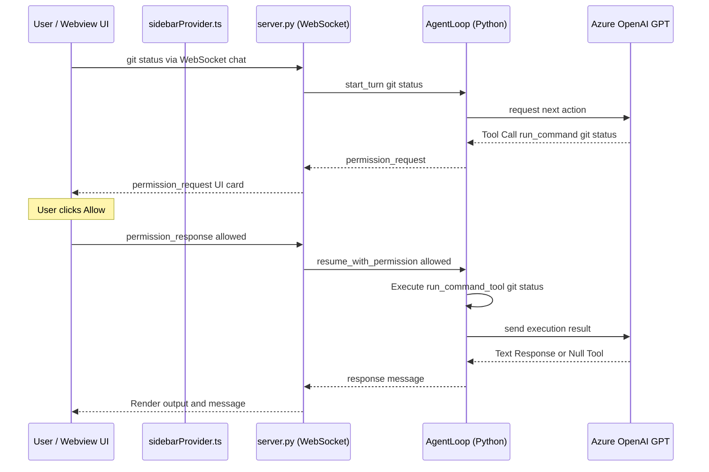

# Nexus SDLC — "Ask First" Autonomous Agent Loop Walkthrough

We have successfully migrated the Nexus assistant from a command-response model to a fully autonomous, tool-calling agent loop. The agent is capable of running terminal commands and editing files locally, but enforces a strict "Ask First" policy to request user permission before running mutating tools, and proactively asks clarifying questions when a task is requested without context.

---

## 🏗️ Architecture & Flow

---

## 🛠️ Key Components Implemented

### 1. Agent Tools (`src/core/tools.py`)
- Created wrappers for:
  - `run_command_tool(cmd)`: Runs commands asynchronously.
  - `edit_file_tool(path, content, action)`: Creates, updates, or deletes files safely.
  - `read_file_tool(path)`: Reads workspace files.
  - `list_dir_tool(path)`: Lists directory contents.

### 2. Autonomous Agent Loop (`src/core/agent_loop.py`)
- Implements the agent state machine.
- Defines a comprehensive system prompt enforcing the **Ask First** and **Context Clarification** rules.
- Manages connection states and handles pausing/resuming execution using approval tokens.
- Includes a simulation/mock mode for testing fallback pathways without calling external LLM APIs.

### 3. Server Integration (`src/server/server.py`)
- Refactored `@app.websocket("/ws/chat")` to handle active `AgentLoop` instances.
- Broadcasts real-time events (`thinking`, `permission_request`, `clarification`, `response`, `error`) to the client.

### 4. VS Code Sidebar & CSP (`vscode-extension/src/sidebarProvider.ts`)
- Updated the Content Security Policy to permit WebSocket handshakes (`connect-src`) to local network sockets (`ws://127.0.0.1:*`, `ws://localhost:*`).
- Configured the webview initial state to dynamically share the active backend server URL.

### 5. Webview Logic (`vscode-extension/src/webview/main.js`)
- Re-architected chat transmission to natively use WebSockets instead of POST requests.
- Implemented warning widgets for permission checks.
- Disables the input text area and send button while a permission request is pending.

### 6. Interactive Terminal REPL (`src/cli/terminal.py`)
- Integrated `AgentLoop` into `NlpState`.
- Implemented `run_agent_loop_turn()` to interactively manage the autonomous agent turns.
- Prompts the user with `Allow execution? (y/n): ` when a mutating tool call is made, sending approval/rejection back to the agent loop state machine.

---

## 🔍 Verification & Testing

### 1. Compilation & Packaging
- Successfully compiled: `webpack --mode production` processed all modules.
- Created standalone installer: `nexus-sdlc-0.1.0.vsix` is ready to install.

### 2. Manual Test: Webview UI
1. **Context Clarification**: Type `"write tests"` (lacks context) in the chat window.
   - **Expected Response**: Nexus asks clarifying questions instead of guessing or executing tools.
2. **Permission Request**: Type `"git status"` in the chat window.
   - **Expected Response**: Chat input is disabled and an interactive card appears with Allow/Deny buttons.

### 3. Manual Test: CLI Terminal REPL
1. Run `python -m src.cli.program terminal` to launch the terminal.
2. **Context Clarification**: Type `"write tests"` at the prompt.
   - **Expected Response**: Nexus prints thoughts and outputs: *"Which files should I target, and what are the detailed requirements?"*
3. **Permission Request**: Type `"git status"` at the prompt.
   - **Expected Response**:
     - Prints thought: *"User wants to run git status. Requesting permission."*
     - Prints warning: `🔑 Permission Required: Wants to run tool: run_command`
     - Prompts for confirmation: `Allow execution? (y/n): `
     - Type `y` to allow. The tool runs, streams stdout to the console, and concludes the turn.
     - Type `n` to deny. The agent receives the refusal and reports it.
