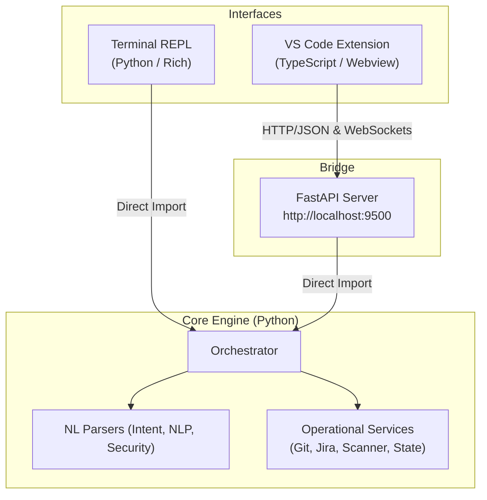

# Nexus — Enterprise AI SDLC Terminal Assistant

An intelligent, workspace-agnostic CLI engine designed to orchestrate the entire Software Development Lifecycle (SDLC). Nexus integrates AI-driven code generation, security governance, and DevOps automation into a single, conversational terminal interface that can be installed and used in any local repository.

---

## 🌟 Key Capabilities

Nexus isn't just a chatbot; it's a **context-aware execution engine** that understands your codebase, enforces your organization's security standards, and automates repetitive engineering tasks through five specialized operational modes.

### 🚀 1. Main (Nexus) Mode: Conversational Orchestration
The central hub for managing your development workflow. 
- **Task**: Ticket management, implementation planning, and mode switching.
- **Natural Language Support**: You can talk to Nexus naturally to perform tasks (e.g., *"Show me my tickets"*, *"Work on AUTH-101"*).
- **Implementation**: Uses a hybrid **Regex + LLM Intent Parser** to map natural speech to core orchestrator functions.
- **Tech Stack**: `Commander.js`, `Fuse.js` (for ticket lookup), and `Azure OpenAI`.

### 🛡️ 2. Security Mode: AI-Driven SAST & Governance
A specialized environment for deep security analysis.
- **Task**: Vulnerability scanning, secret detection, and compliance auditing.
- **Core SAST Categories**: Automatically categorizes findings into Injection Flaws, XSS, Broken Access Control, Insecure Crypto, Secrets Management, etc.
- **AI-Powered Detection**: Unlike traditional regex-based scanners, Nexus uses AI to reason about code logic, significantly reducing false positives.
- **Self-Healing Logic**: Includes an **Auto-Correction Layer** that verifies AI-reported line numbers against actual file content on disk to ensure 100% accuracy.
- **Tech Stack**: Custom AI Security Prompts, `Gitleaks` logic mappings, and the Nexus "Verified Location" algorithm.

### ⚙️ 3. DevOps Mode: CI/CD & Infrastructure
Governance for your delivery pipeline and infrastructure-as-code.
- **Task**: Jenkins pipeline validation, Dockerfile security auditing, and Terraform resource tracking.
- **Automation**: Natural language triggers for release branch creation, hotfix deployments, and PR readiness checks.
- **Tech Stack**: Jenkins Declarative DSL parser, `Trivy` (logic mapping), and `Checkov` (logic mapping).

### 🌿 4. Git Mode: NL-Powered Version Control
A simplified, conversational interface for complex Git operations.
- **Task**: Managing branches, commits, merges, and rollbacks using plain English.
- **Intelligent Diffing**: Ability to summarize changes before committing.
- **Safety First**: Enforces enterprise branching policies (e.g., preventing direct pushes to `main`).
- **Tech Stack**: `simple-git`, custom Git-specific NL Intent Parser.

### 💬 5. NLP Mode: Generative Repo Chat & Editing
The "Autonomous Engineer" mode.
- **Task**: Understanding the codebase and performing multi-file edits.
- **Generative Edits**: *"edit src/auth.ts: add a password reset endpoint"* — Nexus handles the context window, identifies the file, and applies the changes.
- **Undo/Redo**: Maintains snapshots of the workspace to allow instant rollbacks of AI-generated code.
- **Tech Stack**: **Agentic Workflows** (Planner Agent → Code Agent → Test Agent).

---

## 🛠️ Technical Implementation & Architecture

Nexus uses a hybrid architecture, decoupling the core AI engine from the user interfaces.

### Dual-Interface Architecture



- **Core Engine (Python)**: Contains the `Orchestrator`, which manages state, routes commands, and interacts with LLMs.
- **Terminal REPL**: A native CLI interface built with `prompt_toolkit` and `rich`, running in the same process as the core engine.
- **VS Code Extension**: A TypeScript-based extension featuring a premium dark-themed webview for rich chat interactions. It communicates with the core engine via a FastAPI bridge server.
- **FastAPI Bridge**: A lightweight REST and WebSocket server that wraps the Core Engine, allowing external clients (like the VS Code extension) to interact with Nexus.

### Hybrid Intent Parsing
Nexus uses a dual-layer parsing strategy for maximum speed and intelligence:
1.  **Regex Layer**: Instantly recognizes standard commands for zero latency.
2.  **AI Fallback**: If no regex matches, the request is sent to a specialized "Intent Parser" which resolves the natural language into a structured JSON command.

### Agentic Workflow Architecture
When performing complex tasks (like `execute <ticket>`), Nexus coordinates three distinct AI agents:
- **Planner Agent**: Analyzes the ticket and repo context to build a technical step-by-step plan.
- **Code Agent**: Implements the logic across multiple files based on the plan.
- **Test Agent**: Automatically generates unit and integration tests for the new code.

### Terminal UX & Aesthetics
- **Loading Spinner**: Custom-built `Spinner` utility providing real-time feedback for long-running AI tasks.
- **Panel-Based UI**: High-contrast, boxed reporting using the `panel` utility for clean, readable scan results and plans.
- **Deterministic AI**: Configured at `temperature: 0.0` for consistent, reliable security and code analysis.

---

## 💻 Installation & Usage

Nexus is designed to be installed globally and used in any workspace.

### Global Installation
```bash
# Clone the repository
git clone https://github.com/chinmayshete/sdlc-terminal.git
cd sdlc-terminal

# Install globally
npm install -g .
```

### Initializing in a Workspace
1. Navigate to any project folder.
2. Ensure you have an `.env` file with your `AZURE_OPENAI_ENDPOINT` and `AZURE_OPENAI_API_KEY`.
3. Launch the terminal:
```bash
nexus terminal
```

---

## 🎫 Available Commands (Main Mode)

| Command | Natural Language Example | Task |
| :--- | :--- | :--- |
| `tickets` | *"Show me the tickets"* | List all work items in the workspace. |
| `plan <id>` | *"Build a plan for AUTH-101"* | Generate a step-by-step AI implementation plan. |
| `plan <id> detailed` | *"Generate the detailed plan"* | Build a comprehensive technical architecture plan. |
| `execute <id>` | *"Start working on USER-201"* | Generate code and tests for the ticket. |
| `status` | *"How are my tickets doing?"* | View the current status of all tickets. |
| `push <id>` | *"Push AUTH-101 to remote"* | Confirm and push changes to Git remote. |
| `security` | *"Switch to security mode"* | Enter the Security assistant mode. |
| `nlp` | *"Let's talk about the code"* | Enter the repo-wide chat and editing mode. |
| `devops` | *"Switch to devops mode"* | Enter the DevOps assistant mode. |
| `git` | *"Open git mode"* | Enter the Git operations mode. |

---

## 📖 Mode-Specific Command Reference

### 🛡️ Security Mode
*Focus: Vulnerability detection and compliance governance.*

| Command | Task |
| :--- | :--- |
| `scan` | Run a full AI-driven SAST scan on the entire workspace. |
| `scan errors` | Display only the critical ERROR findings. |
| `scan file <path>` | Perform a targeted scan on a specific file. |
| `secrets` | Scan for hardcoded API keys, tokens, and passwords. |
| `compliance` | Run an enterprise-grade compliance check against SDLC policies. |
| `docker security` | Audit the Dockerfile for security misconfigurations. |
| `terraform security` | Analyze Terraform files for infrastructure vulnerabilities. |
| `dashboard` | View the comprehensive Security Dashboard. |
| `posture` | Get a high-level summary of the workspace's security health. |

### ⚙️ DevOps Mode
*Focus: CI/CD pipelines, containerization, and infrastructure.*

| Command | Task |
| :--- | :--- |
| `cicd` | Show the Jenkins/GitHub Actions pipeline stages and status. |
| `jenkins-validate` | Check the local Jenkinsfile for syntax and policy errors. |
| `docker-info` | Analyze Docker layers and base image security. |
| `terraform-info` | List all infrastructure resources managed by Terraform. |
| `deps audit` | Check `package.json` for known vulnerabilities (FOSS). |
| `health` | Perform a full system health check (AI, Git, Config, Pipeline). |
| `pr-check` | Run a "PR Readiness" audit to ensure code is ready for merging. |
| `env validate` | Compare and validate `.env` files across environments. |

### 🌿 Git Mode
*Focus: Conversational version control and repository management.*

| Command | Task |
| :--- | :--- |
| `status` | Show the current working tree status. |
| `log [count]` | View recent commit history with AI-friendly formatting. |
| `diff [file]` | Inspect changes made to specific files. |
| `commit <msg>` | Create a commit following conventional commit standards. |
| `branch` | List, create, or delete branches safely. |
| `merge <branch>` | Perform a merge with automatic GitFlow policy checks. |
| `rollback [sha]` | Safely revert to a previous state while preserving history. |
| `stash / pop` | Temporarily save changes to work on another task. |

### 💬 NLP Mode
*Focus: Generative code editing and repository intelligence.*

| Tool | Task |
| :--- | :--- |
| `explain <file>` | Get a line-by-line AI explanation of a specific file. |
| `edit <file>: <msg>` | Instruct the AI to modify or add code to a file. |
| `show diff` | Visualize the changes made by the last AI generation. |
| `undo last nlp change` | Instantly revert the last set of files modified by the AI. |
| `explain auth flow` | Ask general architecture questions across multiple files. |

---

## 🏗️ Technology Stack

**Core & Terminal:**
- **Runtime**: Python 3.10+
- **CLI/Styling**: Rich, Prompt Toolkit, Click
- **API Server**: FastAPI, Uvicorn, Pydantic
- **AI Platform**: Azure OpenAI (GPT-4o)
- **Version Control**: GitPython

**VS Code Extension:**
- **Language**: TypeScript
- **Framework**: VS Code Extension API, Webviews
- **Bundler**: Webpack

---
*Created by the Google Deepmind team for Advanced Agentic Coding.*
